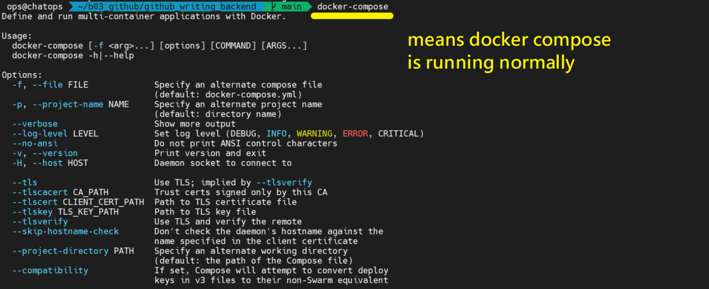
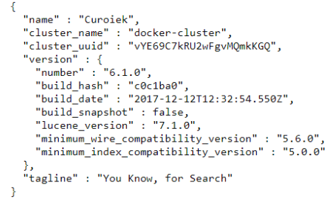

Chinese Reference
https://github.com/twtrubiks/docker-elk-tutorial

# Install Docker

Just in case if you haven't installed docker and docker-compose, you can follow the simple steps below

1. **curl -fsSL https://get.docker.com -o get-docker.sh**
2. **sudo sh get-docker.sh**
3. **verify docker is running**

   

# Install Docker compose

1. **sudo curl -L https://github.com/docker/compose/releases/download/1.21.2/docker-compose-`uname -s`-`uname -m` -o /usr/local/bin/docker-compose**
2. **sudo chmod +x /usr/local/bin/docker-compose**
3. **docker-compose --version**

   

# Installing ELK on docker

1. **Git clone ${target_folder} https://github.com/twtrubiks/docker-elk-tutorial.git**
2. cd to the correct folder, which is ${target_folder}/docker-elk
3. docker-compose up

   

4. **docker ps**, verify that docker are running correctly

   

5. check if Elesticsearch is running **http://${your_ip}:9200,** you should see something like this
   
6. Check if Kibana is running, it take some time to initialize Kibana **http://${your_ip}:5601**

# Initializing the index on Kibana

**curl -XPOST -D- 'http://${your_ip}:5601/api/saved_objects/index-pattern' \
 -H 'Content-Type: application/json' \
 -H 'kbn-version: 6.1.0' \
 -d '{"attributes":{"title":"logstash-\*","timeFieldName":"@timestamp"}}'**

1. **http://${your_ip}:5601**
2. Under Management, you should see your index **logstash-**
   
3. Send some file to logstash, make sure everything is working, **nc ${your_ip} 5000 < README.md**
   

Thank you for reading
